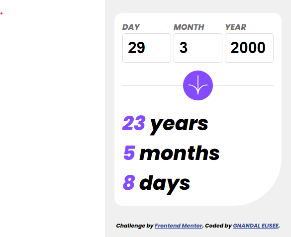
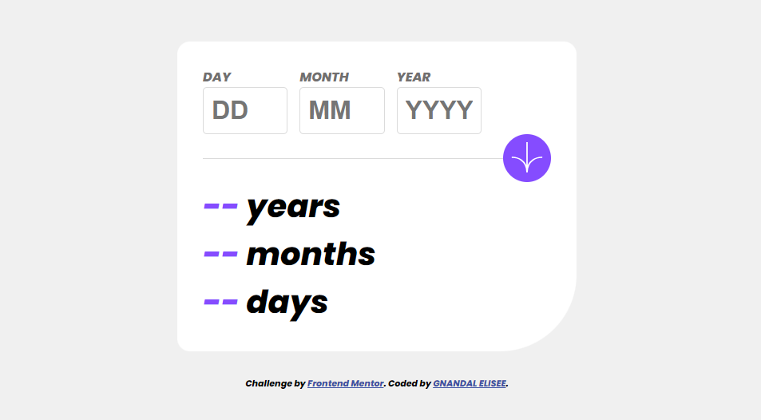
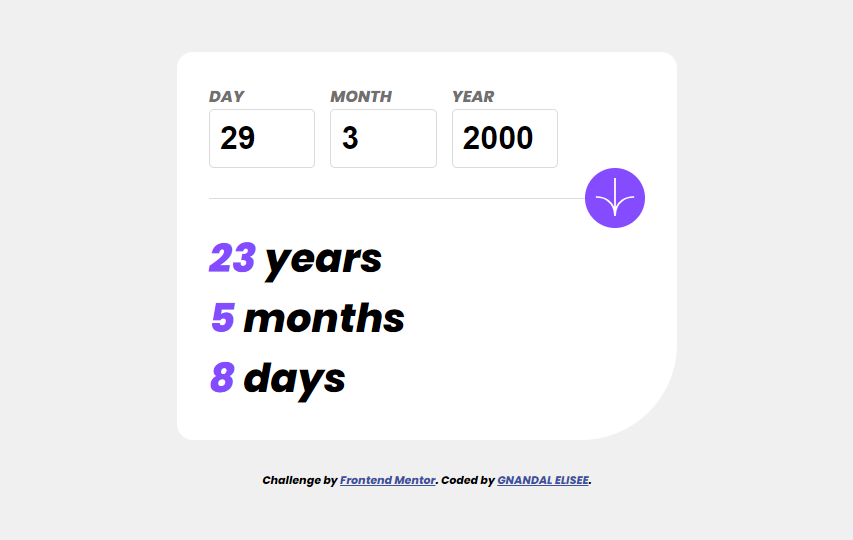
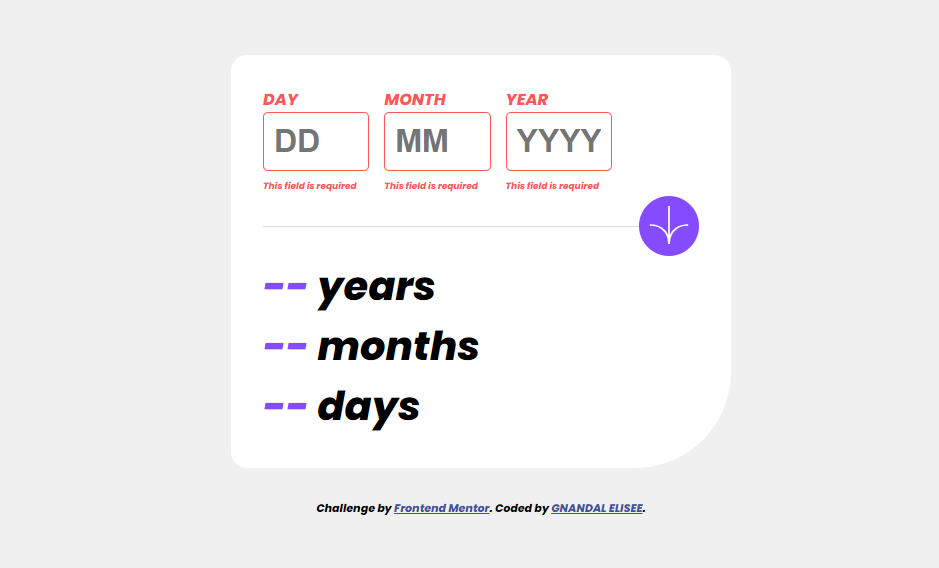
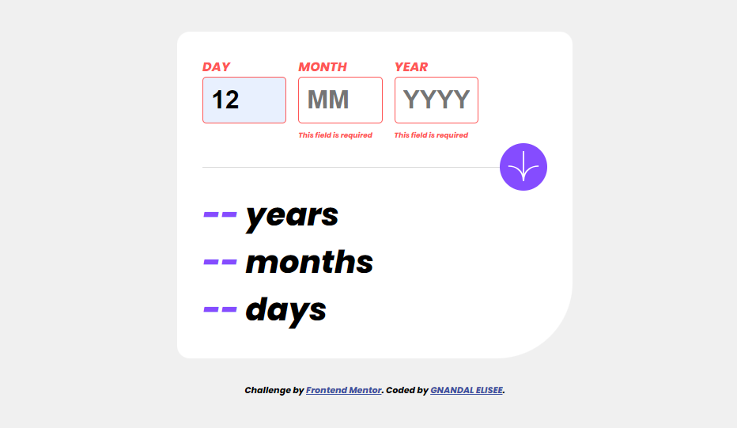
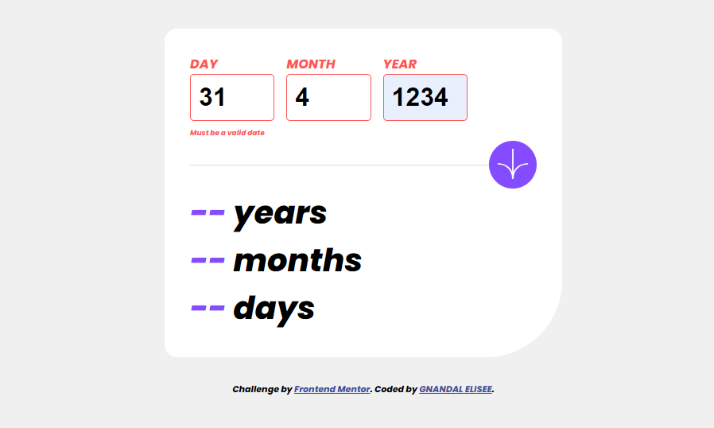
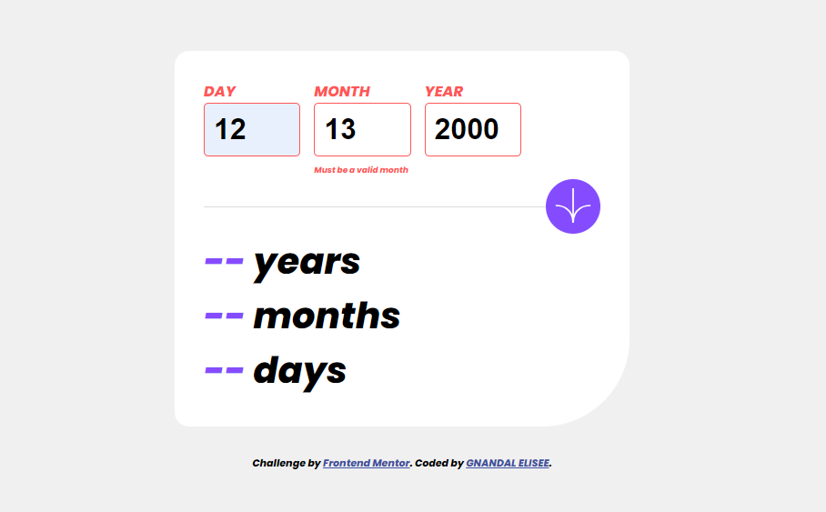
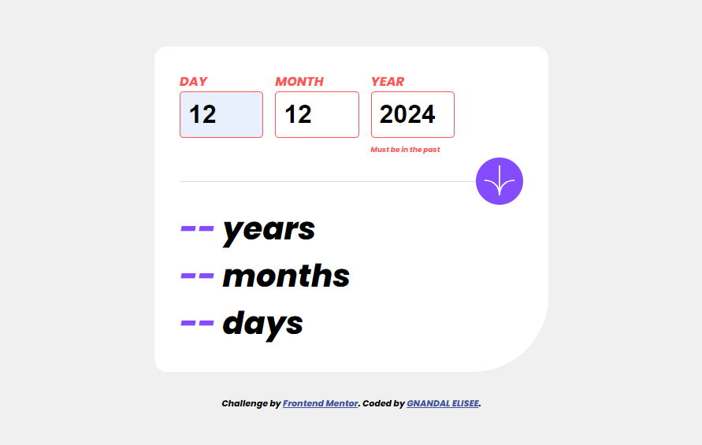

# Frontend Mentor - Age calculator app solution

This is a solution to the [Age calculator app challenge on Frontend Mentor](https://www.frontendmentor.io/challenges/age-calculator-app-dF9DFFpj-Q). Frontend Mentor challenges help you improve your coding skills by building realistic projects.

## Table of contents

- [Overview](#overview)

   - [The challenge](#the-challenge)
   - [Screenshot](#screenshot)
   - [Links](#links)

- [My process](#my-process)

   - [Built with](#built-with)
   - [What I learned](#what-i-learned)
   - [Continued development](#continued-development)
   - [Useful resources](#useful-resources)

- [Author](#author)
- [Acknowledgments](#acknowledgments)

## Overview

### The challenge

Users should be able to:

- View an age in years, months, and days after submitting a valid date through the form
- Receive validation errors if:

   - Any field is empty when the form is submitted
   - The day number is not between 1-31
   - The month number is not between 1-12
   - The year is in the future
   - The date is invalid e.g. 31/04/1991 (there are 30 days in April)

- View the optimal layout for the interface depending on their device's screen size
- See hover and focus states for all interactive elements on the page
- **Bonus**: See the age numbers animate to their final number when the form is submitted

### Screenshot

















### Links

- Solution URL: [A solution URL here](https://github.com/Gnandal/age_calculator/)
- Live Site URL: [A live site URL here](https://gnandal.github.io/age_calculator/)

## My process

### Built with

- Semantic HTML5 markup
- CSS custom properties
- Mobile First Design
- Flexbox
- CSS Grid
- JavaScript

### What I learned

I remember my classes about CSS grid layout, and I learn How to attach event to HTML element.

To see how you can add code snippets, see below:

```html
<section class="field-section">
  <div>
    First Element
  </div>
   
  <div>
    Second Element
  </div>

  <div>
    Third Element
  </div>
</section>
```

```css
.field-section {
  width: 100%;
  display: grid;
  grid-template-columns: repeat(3, 1fr);
  column-gap: 15px;
}

div {
  height: 50px;
  border: 2px purple solid;
}
```

```js
document.addEventListener('submit', () => {
  console.log("I'm called when you form content !");
})
```

### Continued development

For the rest I would like to core with advanced notions of JavaScript and CSS.

### Useful resources

- [Visual Studio Code](https://code.visualstudio.com/) - Visual Studio Code is a code editor redefined and optimized for building and debugging modern web and cloud applications. I really liked this editor and will use it going forward.  Visual Studio Code is free.
- [Dynamisez vos sites
   web avec Javascript !](https://user.oc-static.com/pdf/309961-dynamisez-vos-sites-web-avec-javascript.pdf) - This is an amazing cours which helped me finally understand how to make site reactive with JavaScript. I'd recommend it to anyone still learning JavaScript. [For more course](https://openclassrooms.com/fr/)

## Author

- Facebook - [GNANDAL VARAWAO ELISEE](https://www.facebook.com/gnandal.varawaoelisee/)
- Frontend Mentor - [@Gnandal](https://www.frontendmentor.io/profile/Gnandal)
- Twitter - [@gnandal_elisee](https://www.twitter.com/gnandal_elisee)
- Email - [egnandal500@gmail.com](egnandal500@gmail.com)

## Acknowledgments

My thanks to my little brother [Nzoupou Théodore](https://www.facebook.com/theodore.nzoupou.3) who motivated me to complete this challenge as soon as possible. My thanks to [Openclassrooms](https://openclassrooms.com/) for their JavaScript courses which were of great help to me. And Thanks to frontend mentor for making the basic resources available to me.
